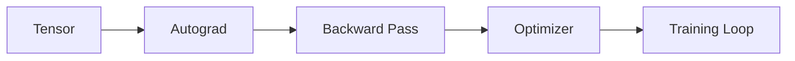

# 🔄 Workflow de Creación de Contenido Semanal

> **Guía paso a paso para crear el contenido de cada semana del bootcamp**

Este documento establece el **orden óptimo de creación** de contenido para cada semana del bootcamp PyTorch, siguiendo las mejores prácticas del [bc-javascript-es2023](https://github.com/ergrato-dev/bc-javascript-es2023).

---

## 📋 Orden de Creación

```
1. README.md de la semana          ← Planificación y objetivos
2. rubrica-evaluacion.md           ← Criterios de evaluación
3. 1-teoria/                       ← Material teórico
4. 0-assets/                       ← Assets vinculados a teoría
5. 2-practicas/                    ← Ejercicios guiados
6. 3-proyecto/                     ← Proyecto integrador
7. 4-recursos/                     ← Recursos completos
8. 5-glosario/                     ← Glosario y cheat sheet
```

---

## 🎯 Fase 1: Planificación (30-60 min)

### 1.1. README.md de la Semana

**Objetivo**: Definir el marco de la semana completa.

**Contenido obligatorio**:

```markdown
# 📅 Semana XX: [Título Descriptivo]

> [Breve descripción de 2-3 líneas sobre qué se aprenderá]

## 🎯 Objetivos de Aprendizaje

Al finalizar esta semana podrás:
- Objetivo específico y medible 1
- Objetivo específico y medible 2
- Objetivo específico y medible 3
- Objetivo específico y medible 4

## 📚 Contenido

### Material Teórico (1-teoria/)
- [Concepto 1](1-teoria/01-concepto.md)
- [Concepto 2](1-teoria/02-concepto.md)
- [Notebook interactivo](1-teoria/notebooks/teoria_01.ipynb)

### Prácticas Guiadas (2-practicas/)
- [Práctica 1: Nombre](2-practicas/practica-01-nombre/)
- [Práctica 2: Nombre](2-practicas/practica-02-nombre/)
- [Práctica 3: Nombre](2-practicas/practica-03-nombre/)

### Proyecto Semanal (3-proyecto/) 🚀
- [Proyecto: Nombre del Proyecto](3-proyecto/README.md)
- **Duración estimada**: 5-6 horas
- **Único entregable obligatorio**

## ⏱️ Distribución del Tiempo (7 horas)

| Actividad | Tiempo | Descripción |
|-----------|--------|-------------|
| 📖 Teoría | 2h | Lectura y notebooks interactivos |
| 💻 Prácticas | 2h | 3-4 ejercicios guiados |
| 🚀 Proyecto | 3h | Proyecto integrador |

## 📋 Requisitos Previos

- Conocimientos de la semana XX
- Conceptos específicos necesarios
- Software/librerías instaladas

## 🗂️ Estructura de Archivos

```
week-XX/
├── README.md
├── rubrica-evaluacion.md
├── 0-assets/
├── 1-teoria/
├── 2-practicas/
├── 3-proyecto/
├── 4-recursos/
└── 5-glosario/
```

## 🔗 Navegación

| ⬅️ Anterior | 🏠 Índice | ➡️ Siguiente |
|:-----------|:----------:|-------------:|
| [Week XX-1](../week-XX-1/) | [Bootcamp](../../README.md) | [Week XX+1](../week-XX+1/) |

## 📚 Recursos Adicionales

Ver carpeta [4-recursos/](4-recursos/) para:
- Papers relacionados
- Videos tutoriales
- Artículos complementarios
- Documentación oficial

---

_Última actualización: [Fecha]_
```

**Checklist antes de continuar**:
- [ ] Objetivos claros y medibles
- [ ] Distribución de tiempo coherente
- [ ] Enlaces a todas las secciones
- [ ] Requisitos previos identificados

---

## 📊 Fase 2: Evaluación (30 min)

### 2.1. rubrica-evaluacion.md

**Objetivo**: Establecer criterios claros de evaluación.

**Estructura base**:

```markdown
# 📊 Rúbrica de Evaluación - Semana XX

## 🎯 Evidencias de Aprendizaje

Esta semana se evalúa mediante **3 tipos de evidencia**:

### 1. 🧠 Conocimiento (30%)

Demuestra comprensión de conceptos mediante:
- Notebooks de teoría completados
- Respuestas a preguntas conceptuales
- Explicaciones en el proyecto

| Nivel | Rango | Criterios |
|-------|-------|-----------|
| **Excelente** | 90-100% | Comprende profundamente, explica con ejemplos propios |
| **Bueno** | 80-89% | Comprende y aplica correctamente |
| **Suficiente** | 70-79% | Comprende conceptos básicos |
| **Insuficiente** | <70% | No demuestra comprensión |

### 2. 💪 Desempeño (40%)

Evaluado mediante las prácticas guiadas:

| Nivel | Rango | Criterios |
|-------|-------|-----------|
| **Excelente** | 90-100% | Código eficiente, bien estructurado, sigue best practices |
| **Bueno** | 80-89% | Código funcional y organizado |
| **Suficiente** | 70-79% | Código funciona pero mejorable |
| **Insuficiente** | <70% | Código no funciona o muy desorganizado |

### 3. 📦 Producto (30%)

Evaluado mediante el proyecto semanal:

| Criterio | Peso | Excelente (90-100%) | Bueno (80-89%) | Suficiente (70-79%) |
|----------|------|---------------------|----------------|---------------------|
| **Funcionalidad** | 40% | Cumple todos los requisitos + extras | Cumple todos los requisitos | Cumple requisitos mínimos |
| **Código Limpio** | 30% | Muy bien organizado, comentado, PEP 8 | Bien organizado | Básicamente organizado |
| **Documentación** | 20% | README completo con conclusiones | README completo | README básico |
| **Visualizaciones** | 10% | Gráficos claros y profesionales | Gráficos funcionales | Gráficos básicos |

## ✅ Criterios Mínimos (Aprobado)

Para aprobar la semana debes:
- [ ] **70% mínimo** en cada tipo de evidencia
- [ ] **Proyecto entregado** y funcionando
- [ ] **Código ejecutable** sin errores críticos
- [ ] **Documentación básica** presente

## 🎯 Peso Final

```
Nota Final = Conocimiento (30%) + Desempeño (40%) + Producto (30%)
```

## 📝 Entrega

**Formato**: Repositorio Git con estructura estándar  
**Fecha límite**: [Especificar]  
**Plataforma**: [Especificar]

---

_Rúbrica Week XX | Bootcamp PyTorch_
```

**Checklist antes de continuar**:
- [ ] Criterios específicos para la semana
- [ ] Porcentajes suman 100%
- [ ] Nivel mínimo para aprobar definido
- [ ] Fecha de entrega especificada

---

## 📖 Fase 3: Material Teórico (2-3 horas)

### 3.1. Carpeta 1-teoria/

**Objetivo**: Crear contenido educativo secuencial.

**Estructura recomendada**:

```
1-teoria/
├── README.md                      # Índice de teoría
├── 01-concepto-fundamental.md     # Primer concepto
├── 02-concepto-avanzado.md        # Concepto que construye sobre el anterior
├── 03-aplicaciones-practicas.md   # Aplicaciones
└── notebooks/
    ├── 01_teoria_interactiva.ipynb
    ├── 02_ejemplos_visuales.ipynb
    └── README.md
```

**Orden de creación**:

1. **README.md de teoría** (índice navegable)
2. **Archivos .md** en orden progresivo (01, 02, 03...)
3. **Notebooks** interactivos con ejemplos ejecutables

**Template para archivos de teoría**:

```markdown
# [Título del Concepto]

> 🎯 **Objetivo**: [Qué aprenderás en 1 línea]

---

## 📋 Contenido

- [Introducción](#introducción)
- [¿Por qué es importante?](#por-qué-es-importante)
- [Conceptos Clave](#conceptos-clave)
- [Implementación](#implementación)
- [Ejemplos](#ejemplos)
- [Visualización](#visualización)

---

## Introducción

[Explicación contextual del concepto]

## ¿Por qué es importante?

[Motivación y aplicaciones reales]

## Conceptos Clave

### Concepto 1

[Explicación]

```python
# Ejemplo de código simple
import torch

# Demo ejecutable
tensor = torch.tensor([1, 2, 3])
print(tensor)
```

### Concepto 2

[Explicación]

## Implementación

```python
# Implementación paso a paso
def mi_funcion(x: torch.Tensor) -> torch.Tensor:
    """
    Descripción detallada.
    
    Args:
        x: Tensor de entrada
    
    Returns:
        Tensor procesado
    """
    # Paso 1: Preparar entrada
    x = x.float()
    
    # Paso 2: Transformar
    result = x * 2
    
    return result
```

## Visualización


## ✅ Checklist de Verificación

- [ ] Entiendo el concepto fundamental
- [ ] Puedo explicarlo con mis propias palabras
- [ ] He ejecutado todos los ejemplos
- [ ] Sé cuándo aplicar esta técnica

## 🔗 Recursos

- [PyTorch Docs](url)
- [Paper Original](url)
- [Tutorial](url)

---

[⬅️ Anterior](00-intro.md) | [🏠 Índice](README.md) | [➡️ Siguiente](02-concepto.md)
```

**Checklist fase teoría**:
- [ ] Al menos 3 archivos .md con conceptos progresivos
- [ ] 1-2 notebooks interactivos
- [ ] Código ejecutable y probado
- [ ] README.md como índice navegable

---

## 🎨 Fase 4: Assets Visuales (30-60 min)

### 4.1. Carpeta 0-assets/

**Objetivo**: Crear y organizar recursos visuales vinculados a la teoría.

**Timing**: Crear DESPUÉS de la teoría, para saber qué diagramas se necesitan.

**Estructura**:

```
0-assets/
├── README.md                    # Índice de assets
├── 01-architecture.png          # Diagramas técnicos
├── 02-data-flow.png
├── 03-concept-visualization.png
└── diagrams-source/             # Archivos editables (opcional)
    ├── 01-architecture.drawio
    └── 02-data-flow.excalidraw
```

**README.md de assets**:

```markdown
# 🎨 Assets Visuales - Semana XX

## 📊 Diagramas Incluidos

### 01-architecture.png
- **Descripción**: Arquitectura de [concepto]
- **Usado en**: [1-teoria/01-concepto.md](../1-teoria/01-concepto.md)
- **Formato**: PNG, 800x600px
- **Licencia**: CC BY-SA 4.0

### 02-data-flow.png
- **Descripción**: Flujo de datos en el pipeline
- **Usado en**: [1-teoria/02-concepto.md](../1-teoria/02-concepto.md)
- **Formato**: PNG, 1000x600px

## 🎨 Convenciones de Diseño

- **Fondo**: Claro (blanco/#F8F9FA)
- **Paleta de colores**:
  - Primario: `#3B82F6` (azul PyTorch)
  - Secundario: `#10B981` (verde)
  - Acento: `#F59E0B` (naranja)
  - Error: `#EF4444` (rojo)
- **Tipografía**: Sans-serif, mínimo 12pt
- **Resolución**: Mínimo 800px ancho para legibilidad

## 🛠️ Herramientas Recomendadas

- **Diagramas**: Excalidraw, Draw.io, diagrams.net
- **Plots**: Matplotlib, Seaborn (exportar a PNG)
- **Esquemas**: Figma, Inkscape

## 📝 Nomenclatura

```
[número]-[descripción-corta].[extensión]

Ejemplos:
✅ 01-cnn-architecture.png
✅ 02-training-loop.png
❌ diagram1.png
❌ img.png
```

---

_Assets Week XX | Bootcamp PyTorch_
```

**Checklist assets**:
- [ ] Cada imagen referenciada en teoría
- [ ] Resolución adecuada (800px+ ancho)
- [ ] Colores consistentes con paleta
- [ ] README.md documenta cada asset
- [ ] Formato optimizado (PNG para diagramas, JPG para fotos)

---

## 💻 Fase 5: Prácticas Guiadas (2-3 horas)

### 5.1. Carpeta 2-practicas/

**Objetivo**: Crear 3-4 ejercicios progresivos para aplicar la teoría.

**Estructura por práctica**:

```
2-practicas/
├── practica-01-nombre-descriptivo/
│   ├── README.md
│   ├── data/                     # Datos de ejemplo (si aplica)
│   ├── starter/
│   │   └── ejercicio.ipynb
│   └── solution/
│       └── ejercicio.ipynb
├── practica-02-nombre-descriptivo/
│   └── ...
└── practica-03-nombre-descriptivo/
    └── ...
```

**Orden de creación de cada práctica**:

1. **Definir objetivo** (¿qué concepto se practica?)
2. **Implementar solución completa** (solution/)
3. **Crear versión starter** con estructura guiada
4. **Escribir README.md** con instrucciones

**README.md de práctica**:

```markdown
# 🏋️ Práctica XX: [Nombre Descriptivo]

## 🎯 Objetivo

[Descripción clara de qué se va a aprender y practicar]

## 📋 Conceptos Aplicados

- Concepto 1 de la teoría
- Concepto 2 de la teoría
- Técnica nueva introducida aquí

## ⏱️ Duración Estimada

45 minutos

## 🗂️ Estructura

```
practica-XX/
├── README.md          # Este archivo
├── data/              # Datos de ejemplo
├── starter/           # Tu punto de partida
│   └── ejercicio.ipynb
└── solution/          # Solución de referencia (NO abrir hasta terminar)
    └── ejercicio.ipynb
```

## 📝 Instrucciones

### Paso 1: Preparación (5 min)

1. Abre el notebook `starter/ejercicio.ipynb`
2. Lee todas las instrucciones antes de empezar
3. Revisa el material teórico si es necesario

### Paso 2: Implementación (30 min)

Sigue las secciones del notebook en orden:

1. **Configuración**: Imports y setup
2. **Carga de datos**: Cargar y explorar datos
3. **Procesamiento**: Implementar transformaciones
4. **Modelo**: Definir arquitectura
5. **Entrenamiento**: Loop de entrenamiento
6. **Evaluación**: Métricas y visualización

### Paso 3: Verificación (10 min)

- Ejecuta todas las celdas de arriba a abajo
- Verifica que los resultados tengan sentido
- Compara tus gráficos con los esperados

## ✅ Criterios de Éxito

- [ ] El código ejecuta sin errores
- [ ] Los resultados son coherentes
- [ ] Las visualizaciones son claras
- [ ] El código está comentado

## 💡 Tips

1. **Si te atascas**: Revisa la teoría correspondiente
2. **Debugging**: Usa `print()` para inspeccionar valores
3. **Shapes**: Verifica dimensiones con `.shape`
4. **Device**: Asegúrate de que tensores estén en el mismo device

## ⚠️ Errores Comunes

### Error 1: Shape mismatch
```python
# ❌ Incorrecto
x = torch.randn(10, 5)
y = model(x)  # Error si model espera (batch, 3, 224, 224)

# ✅ Correcto
x = x.reshape(10, 3, 224, 224)  # Ajustar dimensiones
y = model(x)
```

## 🔗 Recursos de Apoyo

- [Teoría: Concepto X](../../1-teoria/01-concepto.md)
- [PyTorch Docs](url)
- [Tutorial Relacionado](url)

---

⏰ **Recuerda**: Esta práctica es para reforzar conceptos. No te frustres si no sale a la primera.

---

_Práctica Week XX | Bootcamp PyTorch_
```

**Notebook starter template**:

```python
# ============================================
# PRÁCTICA XX: [Nombre Descriptivo]
# ============================================

# %% [markdown]
# # 🏋️ Práctica XX: [Título]
# 
# **Objetivo**: [Qué vas a aprender]
# 
# **Conceptos aplicados**:
# - Concepto 1
# - Concepto 2
# - Concepto 3
# 
# **Duración estimada**: 45 minutos

# %% [markdown]
# ## 📦 Paso 1: Imports y Configuración

# %% [code]
# ============================================
# Imports necesarios
# ============================================
import torch
import torch.nn as nn
import torch.nn.functional as F
import matplotlib.pyplot as plt
import numpy as np

# Configurar visualización
%matplotlib inline
plt.style.use('seaborn-v0_8-darkgrid')

# Configurar reproducibilidad
torch.manual_seed(42)
np.random.seed(42)

# Configurar device
device = torch.device('cuda' if torch.cuda.is_available() else 'cpu')
print(f"✅ Device configurado: {device}")

# %% [markdown]
# ## 📊 Paso 2: Carga y Exploración de Datos
# 
# En esta sección cargarás los datos y explorarás su estructura.

# %% [code]
# ============================================
# TODO: Carga de datos
# ============================================
# Descomenta y completa este código:

# def load_data():
#     """Carga los datos de ejemplo."""
#     # Tu código aquí
#     pass
# 
# data = load_data()
# print(f"Shape de los datos: {data.shape}")

# %% [markdown]
# 💡 **Tip**: Usa `data.shape`, `data.dtype` y `data.device` para inspeccionar.

# %% [code]
# ============================================
# Visualización de datos
# ============================================
# Descomenta cuando tengas los datos:

# plt.figure(figsize=(12, 4))
# # Tu código para visualizar
# plt.show()

# %% [markdown]
# ## 🏗️ Paso 3: Definir Modelo
# 
# Implementa la arquitectura del modelo aquí.

# %% [code]
# ============================================
# TODO: Definir modelo
# ============================================

# class MiModelo(nn.Module):
#     """[Descripción del modelo]."""
#     
#     def __init__(self, input_size: int, hidden_size: int, output_size: int):
#         super().__init__()
#         # Definir capas aquí
#         pass
#     
#     def forward(self, x: torch.Tensor) -> torch.Tensor:
#         """Forward pass."""
#         # Implementar aquí
#         pass

# Instanciar modelo
# model = MiModelo(input_size=10, hidden_size=64, output_size=2)
# model = model.to(device)
# print(model)

# %% [markdown]
# ## 🎯 Paso 4: Entrenamiento
# 
# Implementa el loop de entrenamiento.

# %% [code]
# ============================================
# TODO: Configurar entrenamiento
# ============================================

# criterion = nn.CrossEntropyLoss()
# optimizer = torch.optim.Adam(model.parameters(), lr=0.001)
# 
# num_epochs = 10
# losses = []

# %% [code]
# ============================================
# TODO: Loop de entrenamiento
# ============================================

# for epoch in range(num_epochs):
#     # Tu código aquí
#     pass

# %% [markdown]
# ## 📊 Paso 5: Visualización de Resultados
# 
# Grafica las métricas de entrenamiento.

# %% [code]
# ============================================
# Gráfico de pérdida
# ============================================

# plt.figure(figsize=(10, 6))
# plt.plot(losses, label='Training Loss')
# plt.xlabel('Época')
# plt.ylabel('Pérdida')
# plt.title('Curva de Aprendizaje')
# plt.legend()
# plt.grid(True, alpha=0.3)
# plt.show()

# %% [markdown]
# ## ✅ Verificación Final
# 
# Ejecuta esta celda para verificar que todo funciona:

# %% [code]
# ============================================
# Tests básicos
# ============================================

# assert model is not None, "El modelo no está definido"
# assert len(losses) == num_epochs, "Número de épocas incorrecto"
# print("✅ ¡Práctica completada exitosamente!")

# %% [markdown]
# ## 🎉 ¡Felicitaciones!
# 
# Has completado la práctica. Ahora puedes:
# 1. Experimentar con hiperparámetros
# 2. Probar diferentes arquitecturas
# 3. Comparar con la solución de referencia
# 
# ---
# 
# [⬅️ Volver al README](../README.md)
```

**Checklist prácticas**:
- [ ] 3-4 prácticas progresivas
- [ ] Cada práctica con README completo
- [ ] Solución implementada y probada
- [ ] Starter con estructura clara
- [ ] Comentarios guían al estudiante
- [ ] Sin TODOs, usar código comentado

---

## 🚀 Fase 6: Proyecto Integrador (3-4 horas)

### 6.1. Carpeta 3-proyecto/

**Objetivo**: Proyecto aplicando TODOS los conceptos de la semana.

**⚠️ Importante**: Este es el **ÚNICO ENTREGABLE OBLIGATORIO**.

**Estructura**:

```
3-proyecto/
├── README.md                      # Instrucciones del proyecto
├── requirements.txt               # Dependencias específicas
├── data/                          # Datos del proyecto
│   ├── raw/                       # Datos originales
│   ├── processed/                 # Datos procesados
│   └── README.md                  # Cómo obtener/procesar datos
├── starter/                       # Código inicial
│   ├── proyecto.ipynb             # Notebook principal
│   ├── models.py                  # Definiciones de modelos
│   ├── data_loader.py             # Carga de datos
│   ├── utils.py                   # Utilidades
│   └── config.py                  # Configuración
└── solution/                      # Solución de referencia
    └── proyecto.ipynb
```

**README.md del proyecto** (COMPLETO):

```markdown
# 🚀 Proyecto Semana XX: [Título del Proyecto]

> **🎯 ÚNICO ENTREGABLE OBLIGATORIO**: Este proyecto es el único entregable para aprobar la semana.

---

## 📋 Tabla de Contenidos

- [Objetivos](#-objetivos)
- [Descripción](#-descripción)
- [Dataset](#-dataset)
- [Estructura](#️-estructura)
- [Requisitos](#-requisitos)
- [Instrucciones](#-instrucciones)
- [Evaluación](#-evaluación)
- [Entrega](#-entrega)

---

## 🎯 Objetivos

Al completar este proyecto serás capaz de:

1. **[Objetivo técnico 1]**: Descripción específica
2. **[Objetivo técnico 2]**: Descripción específica
3. **[Objetivo técnico 3]**: Descripción específica
4. **[Objetivo conceptual]**: Descripción específica

---

## 📄 Descripción

[Descripción detallada del proyecto, contexto y aplicación real]

### Problema a Resolver

[Descripción del problema en contexto real]

### Solución Propuesta

[Enfoque general de la solución]

---

## 📊 Dataset

### Descripción

- **Nombre**: [Nombre del dataset]
- **Fuente**: [URL o referencia]
- **Tamaño**: XXXX muestras
- **Características**: XXX features
- **Formato**: CSV/JSON/Imágenes

### Obtención de Datos

```bash
# Opción 1: Descarga automática (si está incluido)
cd data/
python download_data.py

# Opción 2: Descarga manual
# 1. Ir a [URL]
# 2. Descargar archivo
# 3. Colocar en data/raw/
```

### Estructura de Datos

```python
# Ejemplo de cómo se ven los datos
{
    'input': tensor([...]),
    'target': tensor([...]),
    'metadata': {...}
}
```

---

## 🗂️ Estructura del Proyecto

```
3-proyecto/
├── README.md              # Este archivo
├── requirements.txt       # Dependencias
├── data/                  # Datos
│   ├── raw/              # Datos sin procesar
│   ├── processed/        # Datos procesados
│   └── README.md
├── starter/               # Tu punto de partida
│   ├── proyecto.ipynb    # Notebook principal (COMPLETAR)
│   ├── models.py         # Definiciones de modelos
│   ├── data_loader.py    # Carga de datos
│   ├── utils.py          # Funciones auxiliares
│   └── config.py         # Configuración
├── checkpoints/           # Modelos guardados
└── results/               # Resultados y gráficos
```

---

## ✅ Requisitos Funcionales

### Obligatorios (70% de la nota)

- [ ] **R1: Carga de datos** (10%)
  - Implementar `data_loader.py`
  - Crear DataLoader de PyTorch
  - Aplicar transformaciones necesarias

- [ ] **R2: Definición del modelo** (15%)
  - Implementar arquitectura en `models.py`
  - Forward pass correcto
  - Comentarios explicativos

- [ ] **R3: Loop de entrenamiento** (20%)
  - Implementar entrenamiento completo
  - Guardar checkpoints
  - Logging de métricas

- [ ] **R4: Evaluación** (15%)
  - Calcular métricas correctas
  - Validación en conjunto de test
  - Análisis de errores básico

- [ ] **R5: Visualización** (10%)
  - Curvas de aprendizaje
  - Matriz de confusión (si aplica)
  - Predicciones de ejemplo

### Opcionales (30% extra)

- [ ] **E1: Experimentación** (10%)
  - Probar 3+ configuraciones de hiperparámetros
  - Documentar resultados comparativos
  - Tabla de comparación

- [ ] **E2: Análisis avanzado** (10%)
  - Análisis de errores detallado
  - Visualización de embeddings
  - Interpretación del modelo

- [ ] **E3: Optimizaciones** (10%)
  - Early stopping
  - Learning rate scheduling
  - Data augmentation avanzada

---

## 🚀 Instrucciones de Desarrollo

### Fase 1: Preparación (30 min)

1. **Leer documentación completa**
   - Este README
   - [Rúbrica de evaluación](../rubrica-evaluacion.md)
   - Documentación del dataset

2. **Configurar entorno**
   ```bash
   cd week-XX/3-proyecto/
   pip install -r requirements.txt
   ```

3. **Explorar starter code**
   - Revisar `proyecto.ipynb`
   - Entender estructura de módulos

### Fase 2: Exploración de Datos (45 min)

1. **Cargar y explorar** datos
2. **Visualizar** muestras
3. **Analizar** distribuciones
4. **Identificar** posibles problemas

💡 **Tip**: Dedica tiempo a entender los datos antes de modelar.

### Fase 3: Implementación del Modelo (60 min)

1. **Diseñar arquitectura**
   - Sketch en papel primero
   - Verificar dimensiones

2. **Implementar en `models.py`**
   ```python
   class MiModelo(nn.Module):
       def __init__(self, ...):
           # Tu implementación
   ```

3. **Probar con datos de ejemplo**
   - Verificar shapes
   - Test de forward pass

### Fase 4: Entrenamiento (60 min)

1. **Implementar loop** de entrenamiento
2. **Configurar** logging y checkpoints
3. **Entrenar** versión baseline
4. **Monitorear** métricas

### Fase 5: Evaluación y Análisis (45 min)

1. **Calcular métricas** en test set
2. **Crear visualizaciones**
3. **Analizar errores**
4. **Documentar findings**

### Fase 6: Documentación y Refinamiento (30 min)

1. **Completar notebook**
   - Agregar comentarios
   - Explicar decisiones
   - Conclusiones

2. **README de entrega**
3. **Limpiar código**
4. **Verificar reproducibilidad**

---

## 📊 Evaluación

### Criterios de Evaluación (ver rúbrica completa)

| Criterio | Peso | Descripción |
|----------|------|-------------|
| **Funcionalidad** | 40% | El código ejecuta y produce resultados |
| **Calidad del Código** | 20% | Organización, comentarios, best practices |
| **Resultados** | 20% | Métricas, visualizaciones, análisis |
| **Documentación** | 20% | README, comentarios, conclusiones |

### Métricas Esperadas

| Métrica | Mínimo | Bueno | Excelente |
|---------|--------|-------|-----------|
| Accuracy | >70% | >80% | >90% |
| Loss | <0.5 | <0.3 | <0.2 |

*(Ajustar según complejidad del proyecto)*

---

## 🎓 Conceptos Integrados

Este proyecto aplica:

- **Teoría**: [Concepto de 1-teoria/]
- **Práctica 1**: [Técnica de práctica 01]
- **Práctica 2**: [Técnica de práctica 02]
- **Nuevo**: [Concepto nuevo introducido aquí]

---

## 💡 Tips y Recomendaciones

### ✅ Mejores Prácticas

```python
# ✅ Hacer
- Empezar simple, incrementar complejidad
- Guardar checkpoints frecuentemente
- Visualizar resultados intermedios
- Documentar mientras codificas
- Usar funciones para código reutilizable

# ❌ Evitar
- Entrenar sin validación
- Hardcodear valores mágicos
- Ignorar warnings
- Código monolítico sin funciones
- No verificar shapes
```

### 🐛 Debugging

```python
# Checkpoint de debugging
print(f"Shape: {tensor.shape}")
print(f"Device: {tensor.device}")
print(f"Dtype: {tensor.dtype}")
print(f"Min/Max: {tensor.min():.2f}/{tensor.max():.2f}")
```

### ⚡ Optimización

```python
# Si el entrenamiento es lento:
1. Reducir batch size
2. Usar GPU si está disponible
3. Reducir épocas para testing
4. Usar subset de datos para debugging
```

---

## 🔗 Recursos de Apoyo

### Documentación
- [PyTorch Tutorial - Tema](url)
- [Dataset Documentation](url)
- [Paper Relevante](url)

### Material del Curso
- [Teoría: Concepto X](../1-teoria/01-concepto.md)
- [Práctica similar](../2-practicas/practica-01/)
- [Glosario](../5-glosario/README.md)

### Comunidad
- [Foro del curso](url)
- [Canal de Slack](url)

---

## 📦 Entrega

### Formato de Entrega

```
apellido-nombre-week-XX/
├── proyecto.ipynb         # Notebook completado
├── models.py             # Si modificaste
├── requirements.txt      # Versiones exactas usadas
├── results/              # Gráficos y resultados
│   ├── training_curves.png
│   ├── confusion_matrix.png
│   └── sample_predictions.png
├── checkpoints/          # Mejor modelo
│   └── best_model.pth
└── README.md            # Con tus conclusiones y resultados
```

### README.md de Entrega

```markdown
# Proyecto Week XX - [Tu Nombre]

## Resultados Obtenidos

| Métrica | Valor |
|---------|-------|
| Train Accuracy | XX% |
| Test Accuracy | XX% |
| Train Loss | X.XX |
| Test Loss | X.XX |

## Configuración Final

- Learning rate: X.XXX
- Batch size: XX
- Épocas: XX
- Arquitectura: [Descripción]

## Conclusiones

[Tus conclusiones sobre el proyecto]

## Dificultades Encontradas

[Qué problemas tuviste y cómo los resolviste]

## Experimentos Adicionales

[Si hiciste la parte opcional]
```

### Checklist Pre-Entrega

- [ ] Todo el código ejecuta sin errores
- [ ] Notebook corre de inicio a fin
- [ ] Todas las visualizaciones se generan
- [ ] requirements.txt incluye todas las dependencias
- [ ] README.md de entrega completado
- [ ] Modelo guardado en checkpoints/
- [ ] Resultados en carpeta results/

### Plataforma de Entrega

**Fecha límite**: [Especificar]  
**Formato**: ZIP o repositorio Git  
**Plataforma**: [Especificar]

---

## ❓ Preguntas Frecuentes

### ¿Puedo usar código de las prácticas?

Sí, es recomendado reutilizar y adaptar código de las prácticas.

### ¿Puedo trabajar en equipo?

[Especificar política del curso]

### ¿Qué hago si no alcanzo las métricas mínimas?

Documentalo en tu README. La evaluación también considera proceso y análisis.

### ¿Puedo usar arquitecturas pre-entrenadas?

[Especificar según la semana]

---

## 📞 Soporte

- **Office hours**: [Horario]
- **Email**: [Correo]
- **Foro**: [URL]

---

_Proyecto Week XX | Bootcamp PyTorch Zero to Hero_

**Última actualización**: [Fecha]
```

**Checklist proyecto**:
- [ ] README ultra-detallado (como el anterior)
- [ ] Dataset documentado y accesible
- [ ] Starter code funcional
- [ ] Solución implementada y probada
- [ ] Criterios de evaluación claros
- [ ] Recursos de apoyo listados

---

## 📚 Fase 7: Recursos Completos (1 hora)

### 7.1. Carpeta 4-recursos/

**Objetivo**: Compilar recursos complementarios de calidad.

**Estructura**:

```
4-recursos/
├── README.md              # Índice de todos los recursos
├── papers/                # Papers académicos
│   ├── README.md         # Resúmenes y relevancia
│   ├── paper-01.pdf
│   └── paper-02.pdf
├── videos/                # Enlaces a videos
│   └── README.md         # Lista curada con timestamps
├── webgrafia/             # Artículos y tutoriales
│   └── README.md         # Enlaces organizados por tema
└── datasets/              # Enlaces o info de datasets adicionales
    └── README.md
```

**README.md principal de recursos**:

```markdown
# 📚 Recursos Adicionales - Semana XX

> Compilación curada de recursos para profundizar en los temas de la semana.

---

## 📋 Índice

- [Papers Académicos](#-papers-académicos)
- [Videos Tutoriales](#-videos-tutoriales)
- [Artículos y Blogs](#-artículos-y-blogs)
- [Documentación Oficial](#-documentación-oficial)
- [Datasets Adicionales](#-datasets-adicionales)
- [Herramientas](#️-herramientas)

---

## 📄 Papers Académicos

Ver carpeta [papers/](papers/) para PDFs completos.

### Paper 1: [Título del Paper]

- **Autores**: [Nombres]
- **Año**: 202X
- **Resumen**: [Breve resumen de 2-3 líneas]
- **Relevancia**: [Por qué es importante para esta semana]
- **Dificultad**: ⭐⭐⭐ (de 5)
- **Link**: [arXiv/URL]

**Sección clave**: Páginas X-Y explican [concepto relevante].

### Paper 2: [Título]

[Similar estructura]

---

## 🎥 Videos Tutoriales

Ver [videos/README.md](videos/README.md) para lista completa.

### Video 1: [Título del Video]

- **Canal**: [Nombre del canal]
- **Duración**: XX minutos
- **Idioma**: Español/Inglés
- **Link**: [URL de YouTube]
- **Descripción**: [Qué cubre el video]

**Timestamps clave**:
- `00:00` - Introducción
- `05:30` - [Concepto importante]
- `12:45` - Implementación práctica
- `20:00` - Conclusiones

**Rating**: ⭐⭐⭐⭐⭐ (5/5)

---

## 📝 Artículos y Blogs

Ver [webgrafia/README.md](webgrafia/README.md) para lista completa.

### Artículo 1: [Título]

- **Fuente**: [Nombre del blog/sitio]
- **Autor**: [Nombre]
- **Link**: [URL]
- **Descripción**: [Qué aporta]
- **Nivel**: Principiante/Intermedio/Avanzado

**Por qué leerlo**: [Razón específica]

---

## 📖 Documentación Oficial

### PyTorch

- [torch.nn](https://pytorch.org/docs/stable/nn.html)
  - Especialmente: `nn.Module`, `nn.Conv2d`
- [torch.optim](https://pytorch.org/docs/stable/optim.html)
  - Especialmente: `Adam`, `SGD`

### NumPy

- [Array manipulation](url)

---

## 🗂️ Datasets Adicionales

Ver [datasets/README.md](datasets/README.md).

### Dataset 1: [Nombre]

- **Descripción**: [Qué contiene]
- **Tamaño**: XXXX muestras
- **Formato**: [CSV/Images/etc]
- **Link**: [URL]
- **Uso recomendado**: [Para qué sirve]

---

## 🛠️ Herramientas

### Para Visualización

- **TensorBoard**: Monitor de entrenamiento
  ```bash
  pip install tensorboard
  tensorboard --logdir=runs
  ```

- **Netron**: Visualizar arquitecturas
  - [netron.app](https://netron.app/)

### Para Debugging

- **torchsummary**: Resumen de modelos
  ```python
  from torchsummary import summary
  summary(model, input_size=(3, 224, 224))
  ```

---

## 🎯 Ruta de Aprendizaje Sugerida

1. **Para Principiantes** (Comienza aquí)
   - [ ] Ver Video 1
   - [ ] Leer Artículo 1
   - [ ] Revisar Documentación Oficial

2. **Para Profundizar**
   - [ ] Leer Paper 1 (secciones clave)
   - [ ] Ver Video 2 (avanzado)
   - [ ] Experimentar con Dataset Adicional 1

3. **Para Expertos**
   - [ ] Leer Paper 2 completo
   - [ ] Implementar técnica del Paper 1
   - [ ] Contribuir al foro con insights

---

## 📊 Prioridad de Recursos

| Recurso | Prioridad | Tiempo | Nivel |
|---------|-----------|--------|-------|
| Video 1 | 🔴 Alta | 25 min | Básico |
| Artículo 1 | 🔴 Alta | 15 min | Básico |
| Paper 1 (resumen) | 🟡 Media | 30 min | Intermedio |
| Video 2 | 🟡 Media | 40 min | Avanzado |
| Paper 2 completo | 🟢 Baja | 2-3h | Avanzado |

---

## ❓ Cómo Usar Estos Recursos

### Durante la Semana

- **Lunes-Martes**: Teoría + Videos básicos
- **Miércoles-Jueves**: Prácticas + Artículos
- **Viernes-Domingo**: Proyecto + Papers (opcional)

### Después de la Semana

Vuelve a estos recursos si:
- Necesitas repasar conceptos
- Quieres profundizar más
- Estás trabajando en un proyecto similar

---

## 🤝 Contribuciones

¿Encontraste un recurso excelente? Compártelo:
- Abre un issue en el repositorio
- Envía un PR con el recurso
- Comparte en el foro del curso

---

_Recursos Week XX | Bootcamp PyTorch_
```

**Checklist recursos**:
- [ ] Al menos 2 papers relevantes con resúmenes
- [ ] 3-4 videos curados con timestamps
- [ ] 5-6 artículos/tutoriales de calidad
- [ ] Links a documentación oficial
- [ ] Recursos organizados por dificultad
- [ ] README con guía de uso

---

## 📖 Fase 8: Glosario (45 min)

### 8.1. Carpeta 5-glosario/

**Objetivo**: Crear referencia completa de términos y sintaxis.

**Estructura**:

```
5-glosario/
├── README.md              # Glosario de conceptos (definiciones extensas)
└── cheat-sheet.md         # Referencia rápida de sintaxis (copy-paste ready)
```

**README.md - Glosario de Conceptos**:

```markdown
# 📖 Glosario - Semana XX: [Tema]

> Definiciones y explicaciones de términos clave de la semana.

---

## 📋 Índice Alfabético

A | B | C | D | E | F | G | H | I | J | K | L | M
N | O | P | Q | R | S | T | U | V | W | X | Y | Z

---

## A

### Autograd

**Definición**: Sistema de diferenciación automática de PyTorch que calcula gradientes automáticamente.

**Explicación detallada**:
El autograd registra todas las operaciones realizadas sobre tensores con `requires_grad=True` en un grafo computacional dinámico (DAG). Cuando llamas a `.backward()`, recorre este grafo en orden inverso aplicando la regla de la cadena para calcular gradientes.

**Ejemplo**:
```python
x = torch.tensor([2.0], requires_grad=True)
y = x ** 2  # y = 4
y.backward()  # Calcula dy/dx = 2x = 4
print(x.grad)  # tensor([4.])
```

**Relacionado con**: [Backward Pass](#backward-pass), [Gradient](#gradient)

**Usado en**: 
- [Teoría 02: Autograd](../1-teoria/02-autograd.md)
- [Práctica 01](../2-practicas/practica-01/)

---

### Activation Function

**Definición**: Función no lineal aplicada a la salida de una neurona.

**Explicación detallada**:
Las funciones de activación introducen no linealidad en la red, permitiendo aprender patrones complejos. Sin ellas, múltiples capas se reducirían a una transformación lineal equivalente.

**Tipos comunes**:
- **ReLU**: `f(x) = max(0, x)` - Más usada
- **Sigmoid**: `f(x) = 1 / (1 + e^(-x))` - Para salidas [0,1]
- **Tanh**: `f(x) = tanh(x)` - Para salidas [-1,1]

**Ejemplo**:
```python
import torch.nn.functional as F

x = torch.tensor([-1.0, 0.0, 1.0])
relu_output = F.relu(x)  # tensor([0., 0., 1.])
sigmoid_output = torch.sigmoid(x)  # tensor([0.2689, 0.5000, 0.7311])
```

**Cuándo usar**:
- **ReLU**: Capas ocultas (default)
- **Sigmoid**: Clasificación binaria (última capa)
- **Softmax**: Clasificación multi-clase (última capa)

---

## B

### Backward Pass

**Definición**: Proceso de propagar gradientes desde la salida hacia la entrada de la red.

[Continuar con más términos...]

---

## Términos por Categoría

### Tensores
- [Tensor](#tensor)
- [Shape](#shape)
- [Device](#device)
- [Dtype](#dtype)

### Entrenamiento
- [Loss Function](#loss-function)
- [Optimizer](#optimizer)
- [Learning Rate](#learning-rate)
- [Epoch](#epoch)
- [Batch](#batch)

### Arquitectura
- [Layer](#layer)
- [Module](#module)
- [Forward Pass](#forward-pass)
- [Activation Function](#activation-function)

---

## Referencias Cruzadas



---

_Glosario Week XX | Bootcamp PyTorch_
```

**cheat-sheet.md - Referencia Rápida**:

```markdown
# 📋 Cheat Sheet - Semana XX: [Tema]

> Referencia rápida de sintaxis y comandos clave. Copy-paste ready.

---

## 🎯 Sintaxis Esencial

### Crear Tensores

```python
# Desde lista
x = torch.tensor([1, 2, 3])

# Aleatorios
x = torch.randn(3, 4)  # Normal distribution
x = torch.rand(3, 4)   # Uniform [0, 1]

# Ceros y unos
x = torch.zeros(3, 4)
x = torch.ones(3, 4)

# Con misma shape que otro
y = torch.zeros_like(x)
```

### Operaciones Básicas

```python
# Aritméticas
z = x + y
z = x * y
z = x @ y  # Multiplicación matricial

# Shape manipulation
x = x.reshape(2, 6)
x = x.view(-1, 3)  # -1 se infiere automáticamente
x = x.flatten()    # Aplanar todas las dimensiones
```

### Device Movement

```python
# Configurar device
device = torch.device('cuda' if torch.cuda.is_available() else 'cpu')

# Mover tensores
x = x.to(device)
x = x.cuda()  # A GPU
x = x.cpu()   # A CPU
```

---

## 🏗️ Definir Modelos

### Template Básico

```python
import torch.nn as nn

class MiModelo(nn.Module):
    def __init__(self, input_size, hidden_size, output_size):
        super().__init__()
        self.fc1 = nn.Linear(input_size, hidden_size)
        self.fc2 = nn.Linear(hidden_size, output_size)
    
    def forward(self, x):
        x = F.relu(self.fc1(x))
        x = self.fc2(x)
        return x
```

### Capas Comunes

```python
# Fully Connected
nn.Linear(in_features, out_features)

# Convolutional
nn.Conv2d(in_channels, out_channels, kernel_size)

# Pooling
nn.MaxPool2d(kernel_size)
nn.AvgPool2d(kernel_size)

# Normalization
nn.BatchNorm2d(num_features)

# Dropout
nn.Dropout(p=0.5)
```

---

## 🎯 Training Loop

### Template Completo

```python
# Setup
model = MiModelo().to(device)
criterion = nn.CrossEntropyLoss()
optimizer = torch.optim.Adam(model.parameters(), lr=0.001)

# Training loop
for epoch in range(num_epochs):
    model.train()  # Modo entrenamiento
    
    for batch_idx, (data, target) in enumerate(train_loader):
        data, target = data.to(device), target.to(device)
        
        # Forward
        output = model(data)
        loss = criterion(output, target)
        
        # Backward
        optimizer.zero_grad()
        loss.backward()
        optimizer.step()
    
    # Validación
    model.eval()  # Modo evaluación
    with torch.no_grad():
        val_loss = 0
        for data, target in val_loader:
            data, target = data.to(device), target.to(device)
            output = model(data)
            val_loss += criterion(output, target).item()
```

---

## 💾 Guardar y Cargar

### Modelos

```python
# Guardar
torch.save(model.state_dict(), 'model.pth')

# Cargar
model = MiModelo()
model.load_state_dict(torch.load('model.pth'))
model.eval()
```

### Checkpoints Completos

```python
# Guardar
torch.save({
    'epoch': epoch,
    'model_state_dict': model.state_dict(),
    'optimizer_state_dict': optimizer.state_dict(),
    'loss': loss,
}, 'checkpoint.pth')

# Cargar
checkpoint = torch.load('checkpoint.pth')
model.load_state_dict(checkpoint['model_state_dict'])
optimizer.load_state_dict(checkpoint['optimizer_state_dict'])
epoch = checkpoint['epoch']
loss = checkpoint['loss']
```

---

## 📊 Métricas y Evaluación

### Accuracy

```python
def calculate_accuracy(outputs, targets):
    _, predicted = torch.max(outputs, 1)
    correct = (predicted == targets).sum().item()
    total = targets.size(0)
    return 100 * correct / total
```

### Confusion Matrix

```python
from sklearn.metrics import confusion_matrix
import seaborn as sns

# Durante evaluación
all_preds = []
all_targets = []

model.eval()
with torch.no_grad():
    for data, target in test_loader:
        output = model(data.to(device))
        _, preds = torch.max(output, 1)
        all_preds.extend(preds.cpu().numpy())
        all_targets.extend(target.numpy())

# Plotear
cm = confusion_matrix(all_targets, all_preds)
sns.heatmap(cm, annot=True, fmt='d')
plt.show()
```

---

## 🐛 Debugging Tips

### Verificar Shapes

```python
# Agregar prints temporales
print(f"Shape: {x.shape}")
print(f"Device: {x.device}")
print(f"Dtype: {x.dtype}")

# Hook para ver shapes en forward
def print_shape(name):
    def hook(module, input, output):
        print(f"{name}: {output.shape}")
    return hook

model.conv1.register_forward_hook(print_shape("conv1"))
```

### Verificar Gradientes

```python
# Ver si hay gradientes
for name, param in model.named_parameters():
    if param.grad is not None:
        print(f"{name}: {param.grad.norm()}")
    else:
        print(f"{name}: No gradient!")
```

---

## ⚡ Optimizaciones

### Data Loading

```python
# DataLoader con workers
train_loader = DataLoader(
    dataset,
    batch_size=32,
    shuffle=True,
    num_workers=4,  # Paralelizar carga
    pin_memory=True  # Más rápido CPU->GPU
)
```

### Mixed Precision (GPU)

```python
from torch.cuda.amp import autocast, GradScaler

scaler = GradScaler()

for data, target in train_loader:
    optimizer.zero_grad()
    
    with autocast():
        output = model(data)
        loss = criterion(output, target)
    
    scaler.scale(loss).backward()
    scaler.step(optimizer)
    scaler.update()
```

---

## 🔗 Quick Links

- [PyTorch Docs](https://pytorch.org/docs/)
- [Teoría Week XX](../1-teoria/)
- [Glosario Completo](README.md)

---

_Cheat Sheet Week XX | Bootcamp PyTorch_
```

**Checklist glosario**:
- [ ] README.md con definiciones extensas
- [ ] Al menos 20 términos clave definidos
- [ ] Ejemplos de código para cada término
- [ ] cheat-sheet.md con sintaxis copy-paste
- [ ] Template de training loop
- [ ] Sección de debugging
- [ ] Referencias cruzadas entre términos

---

## ✅ Checklist Final de la Semana

### Antes de Publicar

- [ ] **README.md** completo con todos los links
- [ ] **Rúbrica** con criterios específicos de la semana
- [ ] **1-teoria/** con al menos 3 archivos y 1-2 notebooks
- [ ] **0-assets/** con diagramas vinculados a teoría
- [ ] **2-practicas/** con 3-4 prácticas completas
- [ ] **3-proyecto/** con README ultra-detallado
- [ ] **4-recursos/** con papers, videos, artículos curados
- [ ] **5-glosario/** con README y cheat-sheet

### Verificación de Calidad

- [ ] Todo el código ejecuta sin errores
- [ ] Notebooks corren de inicio a fin
- [ ] Links internos funcionan
- [ ] Imágenes cargan correctamente
- [ ] Estilo consistente (PEP 8, Markdown)
- [ ] Comentarios en español, código en inglés
- [ ] Type hints en todas las funciones

### Testing con Usuario

- [ ] Un estudiante puede seguir la semana sin ayuda externa
- [ ] Tiempo total real ≈ 7 horas
- [ ] Progresión de dificultad lógica
- [ ] Proyecto es realizable en 5-6 horas

---

## 🎯 Resumen del Workflow

```
1. README.md (1h)           → Marco general
2. rubrica-evaluacion.md (30min) → Criterios claros
3. 1-teoria/ (2-3h)         → Contenido educativo
4. 0-assets/ (30-60min)     → Diagramas y visuales ← DESPUÉS de teoría
5. 2-practicas/ (2-3h)      → 3-4 ejercicios guiados
6. 3-proyecto/ (3-4h)       → Proyecto integrador
7. 4-recursos/ (1h)         → Compilación curada
8. 5-glosario/ (45min)      → Referencia completa
```

**Tiempo total de creación**: 12-16 horas por semana

---

## 📚 Referencias

- **Ejemplo a seguir**: [bc-javascript-es2023](https://github.com/ergrato-dev/bc-javascript-es2023)
- **Instrucciones Copilot**: [.github/copilot-instructions.md](../../.github/copilot-instructions.md)
- **Estructura base**: [estructura-bootcamp.md](../bootcamp-structure.md)

---

## 🤝 Contribuciones

Si encuentras mejoras a este workflow:
1. Documenta el cambio
2. Actualiza este documento
3. Notifica al equipo

---

_Workflow de Creación | Bootcamp PyTorch Zero to Hero_

**Última actualización**: Febrero 2026  
**Versión**: 1.0
