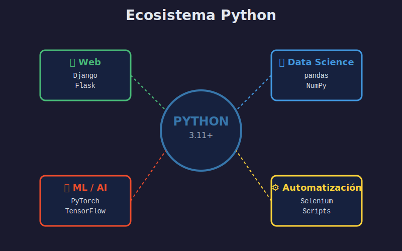

# 🐍 Introducción a Python

> Descubre Python: su historia, filosofía y por qué es el lenguaje ideal para aprender programación y Deep Learning.

---

## 📋 Contenido

- [¿Qué es Python?](#qué-es-python)
- [Historia Breve](#historia-breve)
- [¿Por Qué Python?](#por-qué-python)
- [El Zen de Python](#el-zen-de-python)
- [Casos de Uso](#casos-de-uso)
- [Python en Deep Learning](#python-en-deep-learning)
- [Configuración del Entorno](#configuración-del-entorno)

---

## ¿Qué es Python?

**Python** es un lenguaje de programación de **alto nivel**, **interpretado** y de **propósito general** creado por Guido van Rossum en 1991.

### Características Principales

- **Fácil de leer**: Sintaxis clara y similar al inglés
- **Interpretado**: No necesita compilación, ejecuta línea por línea
- **Dinámicamente tipado**: No necesitas declarar tipos de variables
- **Multiplataforma**: Funciona en Windows, macOS, Linux
- **Orientado a objetos**: Soporta programación OOP
- **Open Source**: Gratuito y con comunidad activa

```python
# Este es un programa Python válido
print("¡Hola, mundo!")
```

---

## Historia Breve

### Línea de Tiempo

```
1989 → Guido van Rossum comienza Python como proyecto navideño
1991 → Python 0.9.0 - Primera versión pública
2000 → Python 2.0 - List comprehensions, garbage collection
2008 → Python 3.0 - Rediseño para mejorar el lenguaje
2020 → Python 2 oficialmente discontinuado
2023 → Python 3.11 - Mejoras de rendimiento significativas
2024 → Python 3.12 - Más optimizaciones
```

### ¿Por Qué "Python"?

Guido van Rossum era fan del grupo cómico británico **Monty Python's Flying Circus**. De ahí el nombre del lenguaje.

---

## ¿Por Qué Python?

### Ventajas

#### 1. **Sintaxis Clara y Legible**

```python
# Python
nombre = "Carlos"
edad = 25
print(f"{nombre} tiene {edad} años")
```

vs

```java
// Java
String nombre = "Carlos";
int edad = 25;
System.out.println(nombre + " tiene " + edad + " años");
```

#### 2. **Curva de Aprendizaje Suave**

- No necesitas entender punteros, memoria, compilación
- Conceptos se introducen gradualmente
- Retroalimentación inmediata (interpretado)

#### 3. **Baterías Incluidas**

Python viene con una **biblioteca estándar** extensa:

```python
import datetime  # Manejo de fechas
import math      # Operaciones matemáticas
import random    # Números aleatorios
import json      # Trabajar con JSON
import csv       # Leer/escribir CSV
# ...y muchas más
```

#### 4. **Ecosistema Rico**

- **PyPI**: 450,000+ paquetes disponibles
- **NumPy**: Computación numérica
- **pandas**: Análisis de datos
- **matplotlib**: Visualización
- **PyTorch**: Deep Learning (¡nuestro objetivo!)

#### 5. **Comunidad Enorme**

- **Stack Overflow**: Millones de preguntas respondidas
- **GitHub**: Proyectos open source
- **PyPI**: Biblioteca de paquetes
- **PyCon**: Conferencias mundiales

### Estadísticas

- 🥇 **2º lenguaje más usado** en GitHub (2023)
- 📈 **+8M desarrolladores** en el mundo
- 💼 **Alta demanda laboral** en IA/ML
- 🎓 **#1 en educación** para enseñar programación

---

## El Zen de Python

Python no es solo un lenguaje, es una **filosofía**. Esto se refleja en el "Zen de Python":

```python
import this
```

### Los 19 Aforismos Clave

```
Beautiful is better than ugly.
Explicit is better than implicit.
Simple is better than complex.
Complex is better than complicated.
Readability counts.
```

**Lo más importante**: El código se lee mucho más de lo que se escribe. Prioriza la **legibilidad**.

### Ejemplo de Código "Pythónico"

```python
# ❌ No pythónico - Poco claro
x = [i for i in range(10) if i % 2 == 0]

# ✅ Pythónico - Claro y legible
numeros_pares = [numero for numero in range(10) if numero % 2 == 0]
```

---

## Casos de Uso

Python tiene un ecosistema diverso que abarca múltiples dominios:



### 1. **Web Development**

- **Django**: Framework full-stack (Instagram, Spotify)
- **Flask**: Microframework (Pinterest, LinkedIn)
- **FastAPI**: APIs modernas (Uber, Netflix)

### 2. **Data Science & Analytics**

- **pandas**: Manipulación de datos
- **NumPy**: Computación numérica
- **Matplotlib/Seaborn**: Visualización
- **Jupyter**: Notebooks interactivos

### 3. **Machine Learning & AI** 🎯

- **PyTorch**: Deep Learning (Facebook)
- **TensorFlow**: ML framework (Google)
- **scikit-learn**: ML clásico
- **Hugging Face**: NLP

### 4. **Automatización**

- **Selenium**: Automatización web
- **BeautifulSoup**: Web scraping
- **Requests**: HTTP requests
- **Scripts**: Tareas repetitivas

### 5. **Otras Aplicaciones**

- **Juegos**: Pygame
- **Desktop Apps**: PyQt, Tkinter
- **IoT**: MicroPython, Raspberry Pi
- **DevOps**: Ansible, SaltStack

---

## Python en Deep Learning

### ¿Por Qué Python Domina el Deep Learning?

1. **Ecosistema Científico**
   - NumPy: Álgebra lineal
   - SciPy: Computación científica
   - pandas: Manejo de datos

2. **Frameworks Maduros**
   - PyTorch: Investigación y producción
   - TensorFlow: Escalabilidad
   - Keras: Alta nivel

3. **Visualización**
   - Matplotlib: Gráficos
   - TensorBoard: Monitoreo
   - Plotly: Interactivo

4. **Flexibilidad**
   - Desarrollo rápido
   - Fácil debugging
   - Prototipado ágil

### Empresas que Usan Python para AI

- **Google**: TensorFlow, JAX
- **Facebook/Meta**: PyTorch
- **OpenAI**: GPT models
- **Tesla**: Autopilot
- **Netflix**: Recomendaciones

---

## Configuración del Entorno

### En Este Bootcamp: Docker 🐳

Para garantizar reproducibilidad, usamos **Docker** con una imagen pre-configurada:

```bash
# Iniciar el entorno
cd bootcamp/week-01/
docker-compose up
```

### ¿Qué Incluye Nuestra Imagen?

```dockerfile
# Python 3.11 oficial
FROM python:3.11-slim

# Herramientas esenciales
- Jupyter Lab
- IPython
- pip (gestor de paquetes)
```

### Verificar Instalación

```python
import sys
print(f"Python version: {sys.version}")
print(f"Python path: {sys.executable}")
```

**Salida esperada**:
```
Python version: 3.11.x ...
Python path: /usr/local/bin/python
```

---

## Tu Primer Programa Python

### En Jupyter Lab

1. Crear una celda nueva
2. Escribir código:

```python
# Mi primer programa Python
print("¡Hola desde Python!")

# Variables
nombre = "Estudiante"
semana = 1

# Operaciones
print(f"Soy {nombre} y estoy en la semana {semana}")
print(f"Semanas restantes: {24 - semana}")
```

3. Ejecutar (Shift + Enter)

### En Terminal

```bash
# Crear archivo
echo 'print("¡Hola, Python!")' > hola.py

# Ejecutar
python hola.py
```

---

## Recursos de Aprendizaje

### Documentación Oficial

- [Python.org](https://www.python.org/)
- [Python Tutorial](https://docs.python.org/3/tutorial/)
- [Python Docs](https://docs.python.org/3/)

### Comunidades

- [r/learnpython](https://reddit.com/r/learnpython)
- [Stack Overflow Python](https://stackoverflow.com/questions/tagged/python)
- [Python Discord](https://pythondiscord.com/)

### Libros Recomendados

- **"Automate the Boring Stuff with Python"** - Al Sweigart
- **"Python Crash Course"** - Eric Matthes
- **"Fluent Python"** - Luciano Ramalho (avanzado)

---

## ✅ Checklist de Verificación

Después de leer esta lección deberías poder:

- [ ] Explicar qué es Python en tus propias palabras
- [ ] Listar al menos 3 ventajas de Python
- [ ] Mencionar 3 casos de uso de Python
- [ ] Ejecutar código Python en Jupyter Lab
- [ ] Entender por qué Python es popular en AI/ML

---

## 🎯 Próximo Paso

Ahora que entiendes qué es Python y por qué lo usamos, es hora de aprender sobre **Variables y Tipos de Datos**.

[➡️ Siguiente: Variables y Tipos de Datos](02-variables-tipos-datos.md)

---

## 💡 Reflexión

> "Python es un lenguaje que permite expresar conceptos en menos líneas de código que sería posible en lenguajes como C++ o Java." - Guido van Rossum

¿Qué te atrajo a Python? ¿Qué esperas aprender?

---

[⬅️ Volver al Índice](README.md) | [🏠 Week-01](../README.md)
