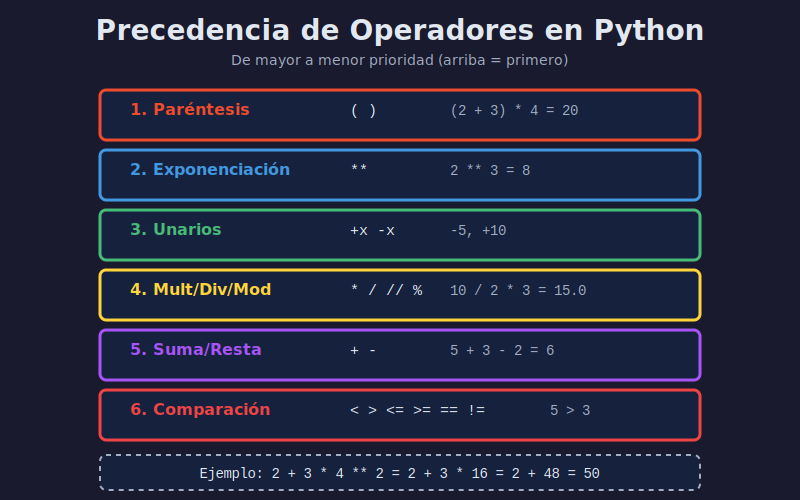

# ⚙️ Operadores

> Aprende a realizar operaciones y comparaciones con los diferentes tipos de operadores en Python.

---

## 📋 Contenido

- [Operadores Aritméticos](#operadores-aritméticos)
- [Operadores de Comparación](#operadores-de-comparación)
- [Operadores Lógicos](#operadores-lógicos)
- [Operadores de Asignación](#operadores-de-asignación)
- [Precedencia de Operadores](#precedencia-de-operadores)

---

## Operadores Aritméticos

Realizan operaciones matemáticas.

| Operador | Nombre | Ejemplo |Resultado |
|----------|--------|---------|----------|
| `+` | Suma | `5 + 3` | `8` |
| `-` | Resta | `5 - 3` | `2` |
| `*` | Multiplicación | `5 * 3` | `15` |
| `/` | División | `5 / 2` | `2.5` |
| `//` | División entera | `5 // 2` | `2` |
| `%` | Módulo (residuo) | `5 % 2` | `1` |
| `**` | Potencia | `5 ** 2` | `25` |

```python
# Ejemplos
x = 10
y = 3

print(f"{x} + {y} = {x + y}")    # 13
print(f"{x} - {y} = {x - y}")    # 7
print(f"{x} * {y} = {x * y}")    # 30
print(f"{x} / {y} = {x / y}")    # 3.333...
print(f"{x} // {y} = {x // y}")  # 3 (sin decimales)
print(f"{x} % {y} = {x % y}")    # 1 (residuo)
print(f"{x} ** {y} = {x ** y}")  # 1000 (10^3)
```

### Casos de Uso

```python
# División entera: distribuir items
items_totales = 23
personas = 5
items_por_persona = items_totales // personas
print(f"Cada persona recibe {items_por_persona} items")  # 4

# Módulo: verificar si es par/impar
numero = 17
if numero % 2 == 0:
    print("Par")
else:
    print("Impar")  # Impar

# Potencia: cálculos exponenciales
radio = 5
area_circulo = 3.14159 * (radio ** 2)
print(f"Área: {area_circulo}")  # 78.53975
```

---

## Operadores de Comparación

Comparan dos valores y retornan `True` o `False`.

| Operador | Nombre | Ejemplo | Resultado |
|----------|--------|---------|-----------|
| `==` | Igual a | `5 == 5` | `True` |
| `!=` | Diferente de | `5 != 3` | `True` |
| `>` | Mayor que | `5 > 3` | `True` |
| `<` | Menor que | `5 < 3` | `False` |
| `>=` | Mayor o igual | `5 >= 5` | `True` |
| `<=` | Menor o igual | `5 <= 3` | `False` |

```python
edad = 18
edad_minima = 18

print(edad >= edad_minima)  # True
print(edad < edad_minima)   # False

# Comparar strings
nombre1 = "Ana"
nombre2 = "ana"
print(nombre1 == nombre2)  # False (case-sensitive)
print(nombre1.lower() == nombre2.lower())  # True
```

### ⚠️ Error Común: = vs ==

```python
# ❌ Incorrecto - Asignación
x = 5
if x = 5:  # SyntaxError
    print("Hola")

# ✅ Correcto - Comparación
if x == 5:
    print("Hola")
```

---

## Operadores Lógicos

Combinan expresiones booleanas.

| Operador | Descripción | Ejemplo | Resultado |
|----------|-------------|---------|-----------|
| `and` | Verdadero si ambos son verdaderos | `True and True` | `True` |
| `or` | Verdadero si al menos uno es verdadero | `True or False` | `True` |
| `not` | Invierte el valor | `not True` | `False` |

### Tabla de Verdad

```python
# AND - Ambos deben ser True
print(True and True)    # True
print(True and False)   # False
print(False and False)  # False

# OR - Al menos uno debe ser True
print(True or True)     # True
print(True or False)    # True
print(False or False)   # False

# NOT - Invierte
print(not True)         # False
print(not False)        # True
```

### Ejemplos Prácticos

```python
# Verificar rango de edad
edad = 25
es_adulto = edad >= 18 and edad < 65
print(f"¿Es adulto? {es_adulto}")  # True

# Verificar acceso
tiene_permiso = True
es_admin = False
puede_acceder = tiene_permiso or es_admin
print(f"¿Puede acceder? {puede_acceder}")  # True

# Validación de datos
nombre = ""
if not nombre:
    print("Nombre no puede estar vacío")
```

### Evaluación Corta (Short-circuit)

```python
# AND se detiene en el primer False
resultado = False and (10 / 0)  # No genera error
print(resultado)  # False

# OR se detiene en el primer True
resultado = True or (10 / 0)  # No genera error
print(resultado)  # True
```

---

## Operadores de Asignación

Asignan valores a variables, a veces con operación.

| Operador | Equivalente | Ejemplo | Resultado |
|----------|-------------|---------|-----------|
| `=` | - | `x = 5` | `x = 5` |
| `+=` | `x = x + 3` | `x += 3` | `x = 8` |
| `-=` | `x = x - 2` | `x -= 2` | `x = 6` |
| `*=` | `x = x * 2` | `x *= 2` | `x = 12` |
| `/=` | `x = x / 3` | `x /= 3` | `x = 4.0` |
| `//=` | `x = x // 2` | `x //= 2` | `x = 2.0` |
| `%=` | `x = x % 2` | `x %= 2` | `x = 0.0` |
| `**=` | `x = x ** 2` | `x **= 2` | `x = 0.0` |

```python
# Contador
contador = 0
contador += 1  # contador = contador + 1
contador += 1
contador += 1
print(contador)  # 3

# Acumulador
total = 0
total += 10
total += 20
total += 30
print(total)  # 60

# Multiplicador
valor = 1
valor *= 2  # valor = valor * 2
valor *= 3  # valor = valor * 3
print(valor)  # 6
```

---

## Precedencia de Operadores

El orden en que Python evalúa operaciones (de mayor a menor prioridad):



1. **Paréntesis**: `()`
2. **Potencia**: `**`
3. **Unarios**: `+x`, `-x`, `not x`
4. **Multiplicativos**: `*`, `/`, `//`, `%`
5. **Aditivos**: `+`, `-`
6. **Comparación**: `==`, `!=`, `>`, `<`, `>=`, `<=`
7. **Lógicos**: `and`, `or`

### Ejemplos

```python
# Sin paréntesis
resultado = 2 + 3 * 4
print(resultado)  # 14 (no 20)
# Orden: 3 * 4 = 12, luego 2 + 12 = 14

# Con paréntesis
resultado = (2 + 3) * 4
print(resultado)  # 20
# Orden: (2 + 3) = 5, luego 5 * 4 = 20

# Complejo
resultado = 10 + 5 * 2 - 3 ** 2
# 3 ** 2 = 9
# 5 * 2 = 10
# 10 + 10 = 20
# 20 - 9 = 11
print(resultado)  # 11
```

### Buena Práctica: Usa Paréntesis

```python
# ❌ Poco claro
resultado = 10 + 5 / 2 * 3

# ✅ Claro
resultado = 10 + ((5 / 2) * 3)
resultado = 10 + (5 / 2 * 3)  # Paréntesis para grupo
```

---

## Operadores Prácticos

### Operador Ternario (Condicional)

```python
# Sintaxis: valor_si_true if condicion else valor_si_false
edad = 20
tipo = "adulto" if edad >= 18 else "menor"
print(tipo)  # "adulto"

# Equivalente con if/else
if edad >= 18:
    tipo = "adulto"
else:
    tipo = "menor"
```

### Operadores de Identidad

```python
x = [1, 2, 3]
y = [1, 2, 3]
z = x

print(x == y)   # True (mismo valor)
print(x is y)   # False (diferentes objetos)
print(x is z)   # True (mismo objeto)
```

### Operadores de Pertenencia

```python
# in / not in
cadena = "Python es genial"
print("Python" in cadena)      # True
print("Java" not in cadena)    # True

numeros = [1, 2, 3, 4, 5]
print(3 in numeros)            # True
print(10 in numeros)           # False
```

---

## Ejercicios

### Ejercicio 1: Calculadora Básica

```python
a = 10
b = 3

print(f"Suma: {a + b}")
print(f"Resta: {a - b}")
print(f"Multiplicación: {a * b}")
print(f"División: {a / b:.2f}")
print(f"División entera: {a // b}")
print(f"Módulo: {a % b}")
print(f"Potencia: {a ** b}")
```

### Ejercicio 2: Par o Impar

```python
numero = int(input("Ingresa un número: "))
es_par = numero % 2 == 0
print(f"¿Es par? {es_par}")
```

### Ejercicio 3: Rango de Edad

```python
edad = int(input("Ingresa tu edad: "))
es_adulto = edad >= 18 and edad < 65
print(f"¿Es adulto en edad laboral? {es_adulto}")
```

---

## ✅ Checklist

- [ ] Conozco los 7 operadores aritméticos
- [ ] Sé la diferencia entre `/` y `//`
- [ ] Puedo usar operadores de comparación
- [ ] Entiendo `and`, `or`, `not`
- [ ] Conozco operadores compuestos (`+=`, `-=`, etc.)
- [ ] Sé usar paréntesis para precedencia

---

## 🎯 Próximo Paso

Ahora que sabes operar con datos, aprende a **controlar el flujo** de tu programa.

[➡️ Siguiente: Estructuras de Control](04-estructuras-control.md)

---

[⬅️ Anterior: Variables y Tipos](02-variables-tipos-datos.md) | [🏠 Índice](README.md)
