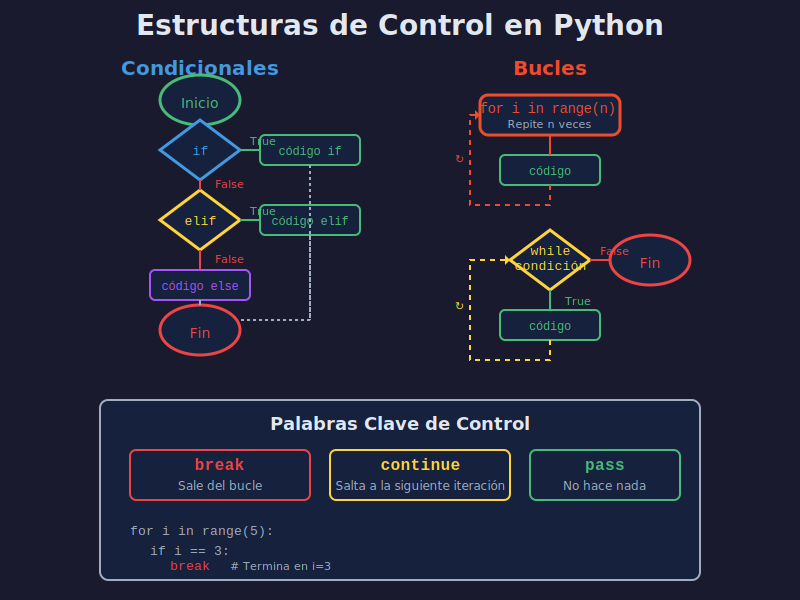

# 🔀 Estructuras de Control

> Aprende a controlar el flujo de ejecución de tu programa con condicionales y bucles.

---

## 📋 Contenido

- [Condicionales (if/elif/else)](#condicionales-ifelifelse)
- [Bucle for](#bucle-for)
- [Bucle while](#bucle-while)
- [Control de Bucles](#control-de-bucles)

---



---

## Condicionales (if/elif/else)

Ejecutan código basándose en condiciones.

### Sintaxis Básica

```python
# if simple
edad = 20
if edad >= 18:
    print("Eres mayor de edad")

# if-else
temperatura = 15
if temperatura > 25:
    print("Hace calor")
else:
    print("Hace frío")

# if-elif-else
nota = 85
if nota >= 90:
    print("A - Excelente")
elif nota >= 80:
    print("B - Muy bien")
elif nota >= 70:
    print("C - Bien")
else:
    print("D - Necesitas mejorar")
```

### Indentación Importante

```python
# ✅ Correcto - 4 espacios
if True:
    print("Línea 1")
    print("Línea 2")

# ❌ Error - Indentación inconsistente
if True:
  print("2 espacios")
    print("4 espacios")  # IndentationError
```

### Condiciones Anidadas

```python
edad = 25
tiene_licencia = True

if edad >= 18:
    if tiene_licencia:
        print("Puede conducir")
    else:
        print("Necesita licencia")
else:
    print("Muy joven para conducir")
```

### Operador Ternario

```python
edad = 20
mensaje = "Mayor" if edad >= 18 else "Menor"
print(mensaje)  # "Mayor"
```

---

## Bucle for

Itera sobre secuencias (rangos, listas, strings).

### Con range()

```python
# range(stop) - de 0 a stop-1
for i in range(5):
    print(i)  # 0, 1, 2, 3, 4

# range(start, stop) - de start a stop-1
for i in range(2, 6):
    print(i)  # 2, 3, 4, 5

# range(start, stop, step) - con salto
for i in range(0, 10, 2):
    print(i)  # 0, 2, 4, 6, 8
```

### Iterar sobre Strings

```python
nombre = "Python"
for letra in nombre:
    print(letra)
# P
# y
# t
# h
# o
# n
```

### Enumerate (índice + valor)

```python
lenguajes = ["Python", "Java", "JavaScript"]
for indice, lenguaje in enumerate(lenguajes):
    print(f"{indice}: {lenguaje}")
# 0: Python
# 1: Java
# 2: JavaScript
```

---

## Bucle while

Ejecuta mientras la condición sea verdadera.

### Sintaxis Básica

```python
# Contador
contador = 0
while contador < 5:
    print(f"Contador: {contador}")
    contador += 1
# 0, 1, 2, 3, 4
```

### ⚠️ Cuidado con Bucles Infinitos

```python
# ❌ Bucle infinito - nunca termina
# while True:
#     print("Esto nunca para")

# ✅ Con condición de salida
opcion = ""
while opcion != "salir":
    opcion = input("Escribe 'salir' para terminar: ")
```

### Validación de Entrada

```python
edad = -1
while edad < 0 or edad > 120:
    edad = int(input("Ingresa edad válida (0-120): "))
print(f"Edad ingresada: {edad}")
```

---

## Control de Bucles

### break - Salir del Bucle

```python
# Buscar un número
for numero in range(1, 11):
    if numero == 5:
        print("¡Encontré el 5!")
        break  # Sale del bucle
    print(numero)
# 1, 2, 3, 4, ¡Encontré el 5!
```

### continue - Saltar Iteración

```python
# Imprimir solo impares
for numero in range(1, 11):
    if numero % 2 == 0:
        continue  # Salta a la siguiente iteración
    print(numero)
# 1, 3, 5, 7, 9
```

### pass - Placeholder

```python
# Para código que escribirás después
for i in range(5):
    if i == 2:
        pass  # TODO: implementar lógica
    else:
        print(i)
```

---

## Ejercicios

### Ejercicio 1: FizzBuzz

```python
# Imprime números 1-15, pero:
# - "Fizz" si es múltiplo de 3
# - "Buzz" si es múltiplo de 5
# - "FizzBuzz" si es múltiplo de ambos

for numero in range(1, 16):
    if numero % 15 == 0:
        print("FizzBuzz")
    elif numero % 3 == 0:
        print("Fizz")
    elif numero % 5 == 0:
        print("Buzz")
    else:
        print(numero)
```

### Ejercicio 2: Suma de Números

```python
# Sumar números del 1 al 100
suma = 0
for i in range(1, 101):
    suma += i
print(f"Suma total: {suma}")  # 5050
```

### Ejercicio 3: Validación de Contraseña

```python
intentos = 3
contraseña_correcta = "python123"

while intentos > 0:
    contraseña = input("Ingresa contraseña: ")
    if contraseña == contraseña_correcta:
        print("¡Acceso concedido!")
        break
    else:
        intentos -= 1
        print(f"Incorrecto. Intentos restantes: {intentos}")
else:
    print("Bloqueado. Sin intentos")
```

---

## ✅ Checklist

- [ ] Puedo usar if/elif/else
- [ ] Sé iterar con for y range()
- [ ] Entiendo cuándo usar while
- [ ] Conozco break, continue, pass
- [ ] Evito bucles infinitos

---

## 🎯 Próximo Paso

Aprende a **encapsular lógica reutilizable** con funciones.

[➡️ Siguiente: Funciones Básicas](05-funciones-basicas.md)

---

[⬅️ Anterior: Operadores](03-operadores.md) | [🏠 Índice](README.md)
