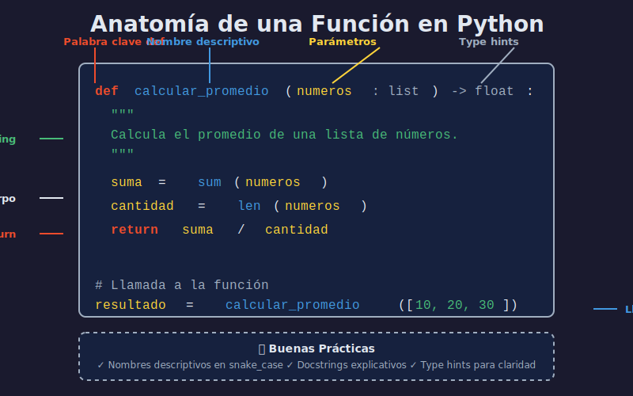

# ⚡ Funciones Básicas

> Aprende a crear funciones para encapsular y reutilizar lógica en Python.

---

## 📋 Contenido

- [¿Qué es una Función?](#qué-es-una-función)
- [Definir Funciones](#definir-funciones)
- [Parámetros y Argumentos](#parámetros-y-argumentos)
- [Return](#return)
- [Scope de Variables](#scope-de-variables)
- [Docstrings](#docstrings)

---

## ¿Qué es una Función?

Una **función** es un bloque de código reutilizable que realiza una tarea específica.

**Ventajas**:
- ✅ **Reutilización**: Escribe una vez, usa muchas veces
- ✅ **Organización**: Código más legible y mantenible
- ✅ **Abstracción**: Oculta detalles de implementación

---

## Definir Funciones

### Sintaxis Básica

Una función en Python tiene varios componentes clave:



```python
def nombre_funcion():
    """Docstring (opcional pero recomendado)"""
    # Código de la función
    print("¡Hola desde la función!")

# Llamar la función
nombre_funcion()  # ¡Hola desde la función!
```

### Ejemplo Práctico

```python
def saludar():
    """Imprime un saludo"""
    print("¡Hola, bienvenido!")

# Llamar múltiples veces
saludar()  # ¡Hola, bienvenido!
saludar()  # ¡Hola, bienvenido!
```

---

## Parámetros y Argumentos

### Función con Parámetros

```python
def saludar(nombre):
    """Saluda a una persona por su nombre"""
    print(f"¡Hola, {nombre}!")

saludar("Ana")     # ¡Hola, Ana!
saludar("Carlos")  # ¡Hola, Carlos!
```

### Múltiples Parámetros

```python
def sumar(a, b):
    """Suma dos números"""
    resultado = a + b
    print(f"{a} + {b} = {resultado}")

sumar(5, 3)   # 5 + 3 = 8
sumar(10, 20) # 10 + 20 = 30
```

### Parámetros por Defecto

```python
def saludar(nombre, saludo="Hola"):
    """Saluda con un saludo personalizable"""
    print(f"{saludo}, {nombre}!")

saludar("Ana")              # Hola, Ana!
saludar("Carlos", "Buenos días")  # Buenos días, Carlos!
```

### Argumentos por Nombre

```python
def presentar(nombre, edad, ciudad):
    print(f"{nombre} tiene {edad} años y vive en {ciudad}")

# Argumentos posicionales
presentar("Ana", 25, "Madrid")

# Argumentos por nombre (cualquier orden)
presentar(ciudad="Barcelona", nombre="Carlos", edad=30)
```

---

## Return

Devuelve un valor de la función.

### Return Simple

```python
def sumar(a, b):
    """Retorna la suma de a y b"""
    return a + b

resultado = sumar(5, 3)
print(resultado)  # 8

# Usar directamente
print(f"10 + 20 = {sumar(10, 20)}")  # 10 + 20 = 30
```

### Return Múltiple

```python
def operaciones(a, b):
    """Retorna suma, resta, multiplicación"""
    suma = a + b
    resta = a - b
    multiplicacion = a * b
    return suma, resta, multiplicacion

# Desempaquetar
s, r, m = operaciones(10, 5)
print(f"Suma: {s}, Resta: {r}, Multi: {m}")
# Suma: 15, Resta: 5, Multi: 50
```

### Sin Return

```python
def imprimir_mensaje():
    print("Mensaje")
    # No hay return explícito

resultado = imprimir_mensaje()
print(resultado)  # None (valor por defecto)
```

---

## Scope de Variables

### Variables Locales

```python
def funcion():
    x = 10  # Variable local
    print(f"Dentro: x = {x}")

funcion()  # Dentro: x = 10
# print(x)  # NameError: x no existe fuera
```

### Variables Globales

```python
x =  100  # Variable global

def funcion():
    print(f"Global x = {x}")  # Puede leer global

funcion()  # Global x = 100

# Para modificar global
def modificar():
    global x
    x = 200

modificar()
print(x)  # 200
```

---

## Docstrings

Documentación de funciones.

### Formato Básico

```python
def calcular_area_rectangulo(base, altura):
    """
    Calcula el área de un rectángulo.
    
    Args:
        base (float): La base del rectángulo
        altura (float): La altura del rectángulo
    
    Returns:
        float: El área del rectángulo
    """
    return base * altura

# Acceder al docstring
help(calcular_area_rectangulo)
print(calcular_area_rectangulo.__doc__)
```

---

## Ejercicios

### Ejercicio 1: Calculadora

```python
def calculadora(a, b, operacion):
    """Realiza operaciones matemáticas básicas"""
    if operacion == '+':
        return a + b
    elif operacion == '-':
        return a - b
    elif operacion == '*':
        return a * b
    elif operacion == '/':
        return a / b if b != 0 else "Error: división por cero"
    else:
        return "Operación no válida"

print(calculadora(10, 5, '+'))  # 15
print(calculadora(10, 5, '/'))  # 2.0
```

### Ejercicio 2: Validar Edad

```python
def es_mayor_edad(edad):
    """Verifica si una persona es mayor de edad"""
    return edad >= 18

print(es_mayor_edad(20))  # True
print(es_mayor_edad(15))  # False
```

### Ejercicio 3: Fahrenheit a Celsius

```python
def fahrenheit_a_celsius(fahrenheit):
    """Convierte temperatura de F a C"""
    celsius = (fahrenheit - 32) * 5/9
    return round(celsius, 2)

print(f"100°F = {fahrenheit_a_celsius(100)}°C")  # 37.78°C
```

---

## ✅ Checklist

- [ ] Puedo definir funciones con `def`
- [ ] Sé usar parámetros y argumentos
- [ ] Entiendo `return`
- [ ] Conozco la diferencia entre variables locales y globales
- [ ] Sé documentar funciones con docstrings

---

## 🎯 ¡Felicitaciones!

Has completado los fundamentos de Python. Ahora practica con los notebooks y ejercicios.

[⬅️ Anterior: Estructuras de Control](04-estructuras-control.md) | [🏠 Índice](README.md) | [➡️ Prácticas](../2-practicas/)
